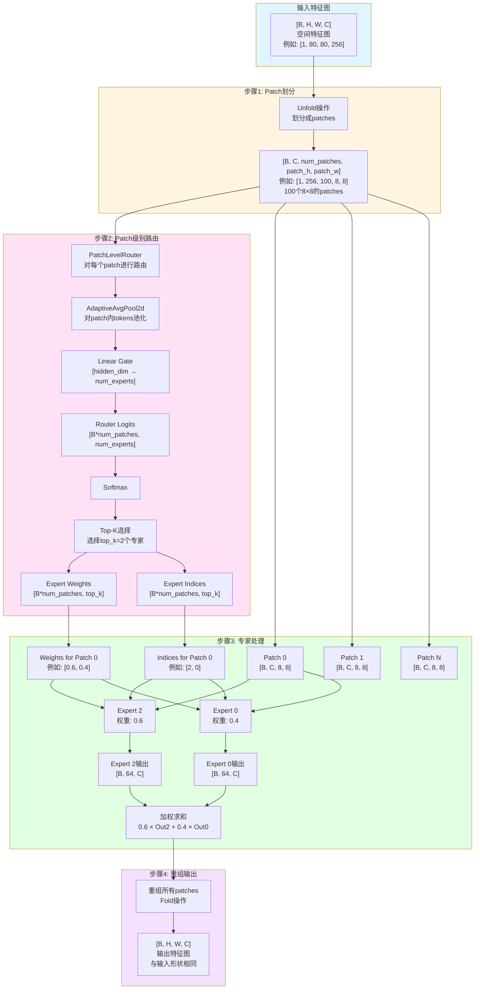
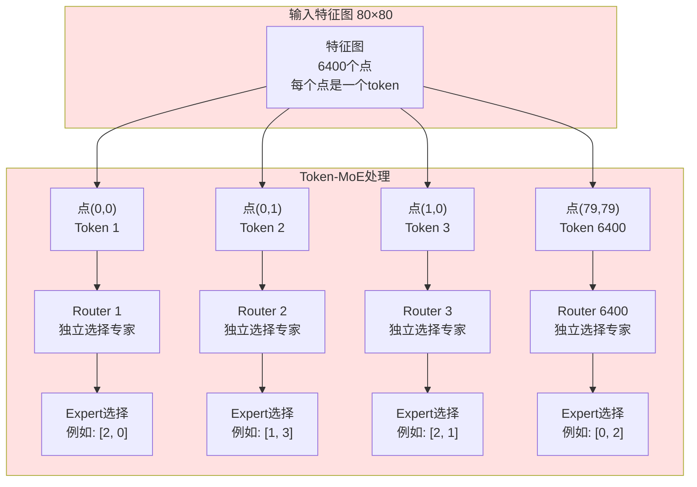
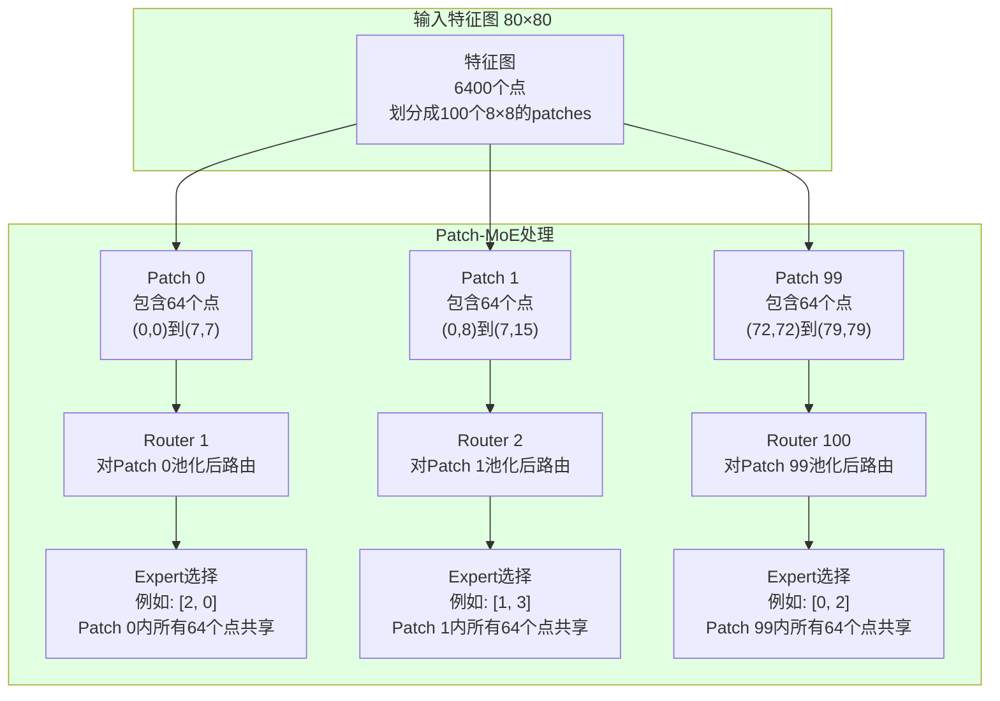

# Patch-MoE 架构图

## Patch-MoE 工作流程



## Token-MoE vs Patch-MoE 详细对比

### 关键理解：Token = 特征图上的一个点

在视觉Transformer中：
- **Token** = 特征图上的一个空间位置（一个点）
- 例如：80×80的特征图 = 6400个tokens = 6400个点

### Token-MoE (Decoder) - 每个点独立选择专家



**特点：**
- 每个点（token）都要独立通过router选择专家
- 路由计算次数 = 特征图点数 = 6400次
- 每个点的路由决策是独立的

### Patch-MoE (Encoder) - 每个Patch统一选择专家



**特点：**
- 每个patch内的所有点（64个tokens）共享同一个路由决策
- 路由计算次数 = patch数量 = 100次（减少64倍！）
- Patch内所有点的路由决策是统一的

### 对比总结

| 维度 | Token-MoE (Decoder) | Patch-MoE (Encoder) |
|------|---------------------|---------------------|
| **路由单位** | 每个点（token） | 每个patch（64个点） |
| **路由计算次数** | 6400次（80×80） | 100次（10×10 patches） |
| **计算效率** | 较低 | **高64倍** |
| **空间局部性** | 无（每个点独立） | **有（patch内共享）** |
| **适用场景** | Decoder（序列建模） | Encoder（空间特征） |

## 关键设计点

### 1. Patch级别路由的优势
- **计算效率**: 路由计算从 N tokens → N_patches (减少64倍，如果patch_size=8)
- **局部性**: Patch内所有tokens共享路由决策，保持空间局部性
- **视觉适配**: 更适合2D空间特征的建模

### 2. 处理流程
```
输入: [B, H, W, C] = [1, 80, 80, 256]
  ↓
划分: 100个 8×8 patches
  ↓
路由: 每个patch选择top_k=2个专家
  ↓
处理: 每个patch通过选中的专家处理
  ↓
融合: 加权求和多个专家的输出
  ↓
输出: [B, H, W, C] = [1, 80, 80, 256]
```

### 3. 与Patch-level Pruning的兼容性
- 两者使用相同的patch划分策略 (patch_size=8)
- Patch-MoE处理patches，Pruning选择保留哪些patches
- 可以无缝集成，实现双稀疏机制

## Patch-MoE 的归纳偏置（Inductive Bias）分析

### 问题：Patch-MoE是否引入了类似CNN的先验？

**答案：是的，但有所不同。**

### CNN的归纳偏置

CNN通过以下机制引入先验：

1. **局部性（Locality）**
   - 卷积核只关注局部区域（如3×3）
   - 相邻像素/特征相关

2. **平移等变性（Translation Equivariance）**
   - 相同的卷积核在图像上滑动
   - 物体平移后，特征也相应平移

3. **权重共享（Weight Sharing）**
   - 同一卷积核在整个图像上共享参数
   - 减少参数量，提高泛化

4. **空间结构（Spatial Structure）**
   - 保持2D空间结构
   - 通过卷积操作保持空间关系

### Patch-MoE的归纳偏置

Patch-MoE通过以下机制引入先验：

#### ✅ 1. 局部性（Locality）- **类似CNN**

```python
# Patch-MoE: Patch内所有tokens共享路由决策
Patch 0 (8×8区域):
  ┌─────────────┐
  │ 64个tokens  │ → 统一选择 Expert [2, 0]
  │ (局部区域)  │    (局部性：相邻tokens共享决策)
  └─────────────┘

# CNN: 卷积核关注局部区域
3×3卷积核:
  ┌─────┐
  │局部 │ → 提取局部特征
  │区域 │    (局部性：相邻像素相关)
  └─────┘
```

**相似点：**
- 都关注局部区域（Patch vs 卷积核感受野）
- 都假设相邻位置相关

**不同点：**
- CNN：通过卷积操作显式建模局部关系
- Patch-MoE：通过patch划分隐式假设局部性

#### ✅ 2. 空间结构（Spatial Structure）- **类似CNN**

```python
# Patch-MoE: 保持2D空间结构
特征图 80×80 → 划分成 10×10 patches → 保持空间布局

# CNN: 保持2D空间结构
特征图 → 卷积 → 特征图（保持空间布局）
```

**相似点：**
- 都保持2D空间结构
- 都通过空间操作（unfold vs 卷积）处理

#### ❌ 3. 平移等变性（Translation Equivariance）- **不同于CNN**

```python
# CNN: 平移等变
物体在(10,10) → 卷积 → 特征在(10,10)
物体在(20,20) → 卷积 → 特征在(20,20)
(相同的卷积核，特征位置相应平移)

# Patch-MoE: 不是完全平移等变
物体在Patch 0 → 路由 → Expert 2
物体在Patch 1 → 路由 → Expert 1 (可能不同)
(路由决策可能不同，因为每个patch独立路由)
```

**不同点：**
- CNN：完全平移等变（相同卷积核）
- Patch-MoE：不是完全平移等变（每个patch独立路由）

#### ❌ 4. 权重共享（Weight Sharing）- **不同于CNN**

```python
# CNN: 权重共享
3×3卷积核在整个图像上共享:
  ┌─────┐  ┌─────┐  ┌─────┐
  │ W1  │  │ W1  │  │ W1  │  (相同权重)
  └─────┘  └─────┘  └─────┘

# Patch-MoE: 无权重共享
每个patch独立路由:
  Patch 0 → Router → Expert [2, 0]
  Patch 1 → Router → Expert [1, 3]  (可能不同)
  (每个patch独立决策，无共享)
```

**不同点：**
- CNN：卷积核权重在整个图像上共享
- Patch-MoE：每个patch独立路由，无权重共享

### 对比总结

| 归纳偏置 | CNN | Patch-MoE | 相似度 |
|---------|-----|-----------|--------|
| **局部性** | ✅ 卷积核关注局部区域 | ✅ Patch内tokens共享决策 | **高** |
| **空间结构** | ✅ 保持2D结构 | ✅ 保持2D结构 | **高** |
| **平移等变性** | ✅ 完全平移等变 | ❌ 不完全平移等变 | **低** |
| **权重共享** | ✅ 卷积核权重共享 | ❌ 无权重共享 | **低** |

### Patch-MoE的独特优势

虽然Patch-MoE不完全等同于CNN，但它结合了：

1. **CNN的局部性** + **Transformer的全局建模**
   - Patch内局部性（类似CNN）
   - 通过Self-Attention实现全局建模（Transformer优势）

2. **自适应路由** vs **固定卷积核**
   - CNN：固定的卷积核（所有位置相同）
   - Patch-MoE：自适应的专家选择（不同patch可能选择不同专家）

3. **更适合视觉任务**
   - 局部性先验：符合视觉任务的局部相关性
   - 空间结构：保持2D特征图结构
   - 灵活性：不同区域可以选择不同的专家处理

### 结论

**Patch-MoE确实引入了类似CNN的先验，但有所增强：**

- ✅ **引入的先验**：局部性、空间结构
- ❌ **未引入的先验**：平移等变性、权重共享
- ✨ **额外优势**：自适应路由、全局建模能力

这使得Patch-MoE在保持CNN局部性优势的同时，又具备Transformer的灵活性和全局建模能力，是两者的良好结合。

